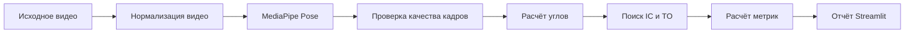

# Running Form Analyzer

Система анализа техники бега по короткой видеозаписи, снятой сбоку.

Приложение использует MediaPipe Pose Landmarker для определения ключевых точек тела, выделяет беговые события и рассчитывает временные и угловые характеристики движения. Результаты отображаются через веб-интерфейс Streamlit.

## Возможности

Система рассчитывает:

- каденс;
- моменты первого контакта стопы с землёй;
- моменты отрыва стопы;
- время контакта стопы с землёй;
- долю опорной фазы;
- наклон туловища;
- амплитуду сгибания коленей;
- сгибание, разгибание и амплитуду движения бёдер;
- минимальные и максимальные углы голеностопа;
- различия между левой и правой сторонами.

Приложение также формирует предупреждения, если для устойчивой оценки недостаточно качественных кадров или полных беговых циклов.

## Как работает система



В проекте используется предварительно обученная модель MediaPipe. Собственная модель машинного обучения в текущей версии не обучается. Поиск беговых событий и расчёт метрик выполняются алгоритмами обработки временных рядов и геометрии ключевых точек.

## Требования

Проект проверен со следующими версиями:

- Python 3.12;
- FFmpeg 6;
- MediaPipe;
- OpenCV;
- Streamlit.

FFmpeg должен быть установлен отдельно и доступен из командной строки.

Для Ubuntu:

```bash
sudo apt update
sudo apt install ffmpeg
```

Проверка установки:

```bash
ffmpeg -version
```

## Установка

После клонирования репозитория перейдите в его каталог:

```bash
cd running-form-analyzer
```

Создайте виртуальное окружение:

```bash
python3.12 -m venv .venv
```

Активируйте его:

```bash
source .venv/bin/activate
```

Установите зависимости:

```bash
python -m pip install --upgrade pip
pip install -r requirements.txt
```

Модель MediaPipe уже находится в проекте:

```text
models/pose_landmarker_full.task
```

## Запуск приложения

```bash
streamlit run app.py
```

Либо без активации виртуального окружения:

```bash
.venv/bin/streamlit run app.py
```

После запуска интерфейс обычно доступен по адресу:

```text
http://localhost:8501
```

## Требования к видео

Для получения устойчивого результата рекомендуется:

- снимать бегуна сбоку;
- использовать неподвижную камеру;
- держать всё тело бегуна в кадре;
- избегать сильных перекрытий ног;
- обеспечить достаточное освещение;
- использовать видео длительностью примерно 5–15 секунд;
- записывать несколько полных беговых циклов.

Поддерживаемые интерфейсом форматы:

- MP4;
- MOV;
- AVI;
- MKV.

## Результаты анализа

После обработки интерфейс показывает:

- основные показатели;
- подробную статистику каденса;
- время контакта с землёй;
- наклон туловища;
- показатели коленей, бёдер и голеностопа;
- предупреждения о качестве данных;
- исходное видео;
- видео с ключевыми точками.

Итоговый отчёт можно скачать в формате JSON.

Временные результаты каждого запуска сохраняются в:

```text
data/app_runs/
```

Этот каталог не отслеживается Git.

## Структура проекта

```text
running-form-analyzer/
├── app.py
├── requirements.txt
├── models/
│   └── pose_landmarker_full.task
└── src/
    ├── pipeline.py
    ├── video/
    │   └── extract_pose.py
    └── analysis/
        ├── frame_quality.py
        ├── calculate_metrics.py
        ├── detect_gait_events.py
        └── analysis_summary.py
```

Назначение основных компонентов:

- `app.py` — пользовательский интерфейс Streamlit;
- `pipeline.py` — последовательный запуск всех этапов анализа;
- `extract_pose.py` — нормализация видео и извлечение ключевых точек;
- `frame_quality.py` — проверка качества кадров и ключевых точек;
- `calculate_metrics.py` — расчёт углов и подготовка временных сигналов;
- `detect_gait_events.py` — определение беговых событий;
- `analysis_summary.py` — формирование итогового отчёта.

## Ограничения

Система анализирует двумерное видео и не восстанавливает полноценное движение в трёхмерном пространстве.

Точность зависит от:

- ракурса камеры;
- качества освещения;
- видимости ног;
- длительности записи;
- количества беговых циклов;
- качества распознавания ключевых точек MediaPipe.

При недостатке данных отдельные показатели могут отсутствовать. В таком случае приложение показывает предупреждение вместо недостоверного значения.

Результаты предназначены для анализа движения и исследовательских целей и не являются медицинской диагностикой.